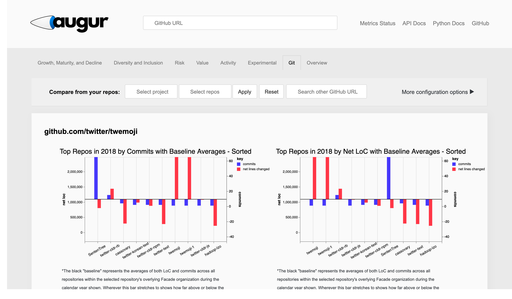
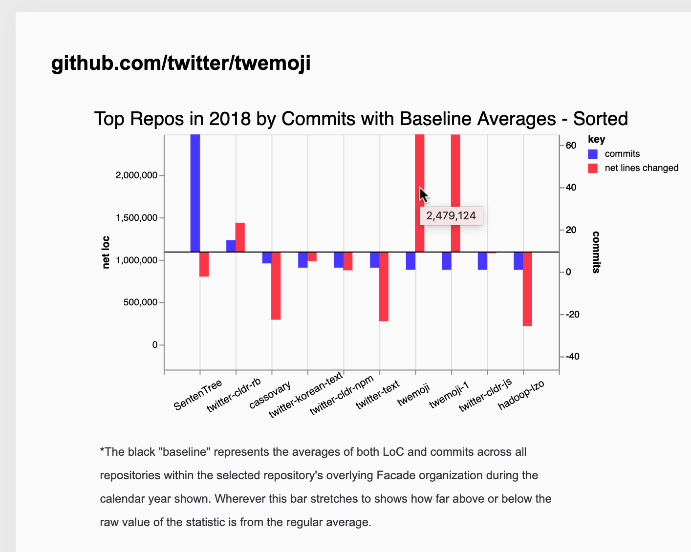
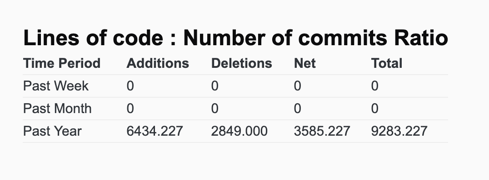
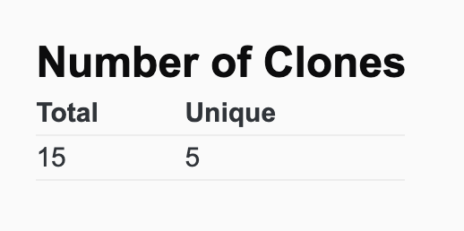

# Augur (Group 10 Fork)

Employment environment: [group10.tk](http://group10.tk:3333)

## About Augur

Augur is focused on prototyping open source software metrics. 

Functionally, Augur is a prototyped implementation of the Linux Foundation's [CHAOSS Project](http://chaoss.community) on [open source software metrics](https://github.com/chaoss/metrics). Technically, Augur is a [Flask web application](http://augurlabs.io), [Python library](http://augur.augurlabs.io/static/docs/) and [REST server](http://augur.augurlabs.io/static/api_docs/) that presents metrics on open source software development project health and sustainability. 

### Our Fork

Tooltips have been added to graphs:

Lines of Code Per Commit : Number of Commits Ratio added:

Number of Clones metric added:

## Guidelines
To contribute to Augur, please check out our [development guide](http://augur.augurlabs.io/static/docs/dev-guide/1-overview.html) and [notes on making contributions](CONTRIBUTING.md). Also, please note our [code of conduct](CODE_OF_CONDUCT.md). We want Augur to be a welcoming development community that is open to everyone. 

## Roadmap
Our technical, outreach, and academic goals [roadmap](https://github.com/chaoss/augur/wiki/Release-Schedule).

## License and Copyright
Copyright © 2018 University of Nebraska at Omaha, University of Missouri and CHAOSS Project at the Linux Foundation

Augur is free software: you can redistribute it and/or modify it under the terms of the MIT License as published by the Open Source Initiative. See the file [LICENSE](LICENSE) for more details.

(This work has been funded through the Alfred P. Sloan Foundation)
